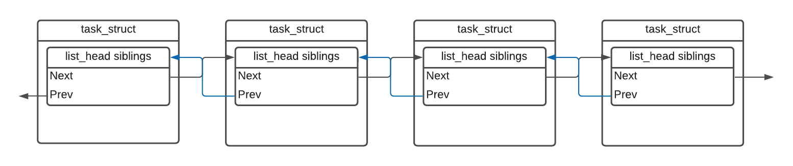

# Implementing a scheduling class

## Introduction

One of the reasons students struggle with this assignment boils down to a lack
of understanding of how the scheduler works. In this guide, I hope to provide
you with a clear understanding of how the Linux scheduler pieces fit together. I
hope to paint a picture that you can use to implement the freezer scheduler.

## The `task_struct`

Recall from HW1 that in Linux, every process is defined by its `struct
task_struct`. When you have multiple tasks forked off a common parent, they are
linked together in a doubly linked-list `struct list_head siblings` embedded
within the `task_struct`. For example, if you had four processes running on your
system, each forked off one parent, it would look something like this (the
parent is not shown):

<div align='center'>
    <br/>
</div>

However, at this stage, none of these processes are actually running on a CPU.
In order to get them onto a CPU, I need to introduce you to the `struct rq`.

## The `struct_rq`

The `struct rq` is a per-cpu run queue data structure. I like to think of it as
the virtual CPU. It contains a lot of information (must of which goes way over
my head), but it also includes the list of tasks that will (eventually) run on
that CPU.

A naive implementation would be to embed a `struct list_head runqueue_head` (for
example) into the `struct rq`, and embed a `struct list_head node` into every
`task_struct`.

<div align='center'>
    <br/>
    This is a BAD implementation.
</div>

The main problem with this implementation is that it does not extend well. At
this point, you know Linux has more than one scheduling class. Linux comes built
with a deadline class, a real-time class, and the primary CFS. Having a
`list_head` embedded directly into the `struct rq` for each scheduling class is
not feasible.

The solution is to create a new structure containing the `list_head` and any
bookkeeping variables. Then, we can include just the wrapper structure in the
`struct rq`. Linux includes these structures in `linux/kernel/sched/sched.h`.

By convention, Linux scheduler-specific wrapper structures are named `struct
<sched_class>_rq`. For example, the CFS class defines a `struct cfs_rq` which is
then declared inside of `struct rq` as `struct cfs_rq cfs`.

The following snippet is taken from `linux/kernel/sched/sched.h`:

```c
struct cfs_rq {
    struct load_weight  load;
    unsigned int        nr_running;
    unsigned int        h_nr_running;
    unsigned int        idle_h_nr_running;
    /* code omitted */
};

struct rq {
    /* code omitted */
    struct cfs_rq       cfs;
    struct rt_rq        rt;
    struct dl_rq        dl;
    /* code omitted */
};
```

## The `freezer_rq`

At this point, you've probably guessed that you will need to do the same thing
for freezer. You are right. The `freezer_rq` should include the head of the
freezer runqueue. Additionally, you may need to include some bookkeeping
variables. Think of what you would actually need and don't add anything extra
(it should be pretty simple).

## The `sched_freezer_entity`

Now that you have the `struct rq` setup, you need to have some mechanism to join
your `task_struct`s into the queue. Here, too, you can't just include a
`list_head node` to add a task onto the scheduler-specific runqueue because
you'll need additional bookkeeping. As you have probably guessed, we are going
to wrap the list_head and all the bookkeeping variables into their own struct.

In Linux, we name these structs `sched_{class}_entity` (one exception is that
CFS names this `sched_entity`). For example, the real-time scheduling class
calls it `sched_rt_entity`. We will name ours `struct sched_freezer_entity`.
Again, make sure you only include what you need in this struct.

With all this setup, here is what the final picture looks like:

<div align='center'>
    <br/>
</div>

In the picture above, the two structs on the far left represent a system with
two CPUs. I colored these blue and green to distinguish them from each other,
and to show that different `task_structs` linked on one `siblings` linked-list
can run on separate CPUs.

## The `sched_class`

At this point, we have set up the data structures, but we are still not done. We
now need to implement the freezer functionality to let the kernel use freezer as
a scheduler.

Think about this situation: Say we have a CFS task about to return from main().
The OS needs to call CFS `dequeue_task()` to remove it from the CFS queue. How
can we ensure that the OS will call the CFS implementation of `dequeue_task()`?
The answer is `struct sched_class`, defined in `linux/kernel/sched/sched.h`.
Here is what the structure looks like:

```c
struct sched_class {

#ifdef CONFIG_UCLAMP_TASK
    int uclamp_enabled;
#endif

    void (*enqueue_task) (struct rq *rq, struct task_struct *p, int flags);
    void (*dequeue_task) (struct rq *rq, struct task_struct *p, int flags);
    void (*yield_task)   (struct rq *rq);
    bool (*yield_to_task)(struct rq *rq, struct task_struct *p);

    void (*check_preempt_curr)(struct rq *rq, struct task_struct *p, int flags);

    struct task_struct *(*pick_next_task)(struct rq *rq);

    void (*put_prev_task)(struct rq *rq, struct task_struct *p);
    void (*set_next_task)(struct rq *rq, struct task_struct *p, bool first);

#ifdef CONFIG_SMP
    int (*balance)(struct rq *rq, struct task_struct *prev, struct rq_flags *rf);
    int  (*select_task_rq)(struct task_struct *p, int task_cpu, int sd_flag, int flags);
    void (*migrate_task_rq)(struct task_struct *p, int new_cpu);

    void (*task_woken)(struct rq *this_rq, struct task_struct *task);

    void (*set_cpus_allowed)(struct task_struct *p,
                 const struct cpumask *newmask);

    void (*rq_online)(struct rq *rq);
    void (*rq_offline)(struct rq *rq);
#endif

    void (*task_tick)(struct rq *rq, struct task_struct *p, int queued);
    void (*task_fork)(struct task_struct *p);
    void (*task_dead)(struct task_struct *p);

    /*
     * The switched_from() call is allowed to drop rq->lock, therefore we
     * cannot assume the switched_from/switched_to pair is serliazed by
     * rq->lock. They are however serialized by p->pi_lock.
     */
    void (*switched_from)(struct rq *this_rq, struct task_struct *task);
    void (*switched_to)  (struct rq *this_rq, struct task_struct *task);
    void (*prio_changed) (struct rq *this_rq, struct task_struct *task,
                  int oldprio);

    unsigned int (*get_rr_interval)(struct rq *rq,
                    struct task_struct *task);

    void (*update_curr)(struct rq *rq);

#define TASK_SET_GROUP      0
#define TASK_MOVE_GROUP     1

#ifdef CONFIG_FAIR_GROUP_SCHED
    void (*task_change_group)(struct task_struct *p, int type);
#endif
} __aligned(STRUCT_ALIGNMENT); /* STRUCT_ALIGN(), vmlinux.lds.h */
```

As you can see, `struct sched_class` contains many function pointers. When we
add a new scheduling class, we create an instance of `struct sched_class` and
set the function pointers to point to our implementation of these functions. If
we look in the file `linux/kernel/sched/fair.c`, we see how CFS does it:

```c
const struct sched_class fair_sched_class
    __section("__fair_sched_class") = {
	.enqueue_task		= enqueue_task_fair,
	.dequeue_task		= dequeue_task_fair,
	.yield_task		= yield_task_fair,
	.yield_to_task		= yield_to_task_fair,

	.check_preempt_curr	= check_preempt_wakeup,

	.pick_next_task		= __pick_next_task_fair,
	.put_prev_task		= put_prev_task_fair,
	.set_next_task          = set_next_task_fair,

#ifdef CONFIG_SMP
	.balance		= balance_fair,
	.select_task_rq		= select_task_rq_fair,
	.migrate_task_rq	= migrate_task_rq_fair,

	.rq_online		= rq_online_fair,
	.rq_offline		= rq_offline_fair,

	.task_dead		= task_dead_fair,
	.set_cpus_allowed	= set_cpus_allowed_common,
#endif

	.task_tick		= task_tick_fair,
	.task_fork		= task_fork_fair,

	.prio_changed		= prio_changed_fair,
	.switched_from		= switched_from_fair,
	.switched_to		= switched_to_fair,

	.get_rr_interval	= get_rr_interval_fair,

	.update_curr		= update_curr_fair,

#ifdef CONFIG_FAIR_GROUP_SCHED
	.task_change_group	= task_change_group_fair,
#endif

#ifdef CONFIG_UCLAMP_TASK
	.uclamp_enabled		= 1,
#endif
};
```

Note that the dot notation is a C99 feature that allows you to set specific
fields of the struct by name in an initializer. This notation is also called
[designated
initializers](http://gcc.gnu.org/onlinedocs/gcc/Designated-Inits.html). Also,
not every function needs to be implemented. You will need to figure out what is
and is not necessary. To see an example of a bare minimum scheduler, see the
[idle_sched_class](https://elixir.bootlin.com/linux/v5.10.57/source/kernel/sched/idle.c#L487),
which is the scheduling policy used when no other tasks are ready to be
executed.

As you can see, CFS initializes the `struct sched_class` function pointers to
the CFS implementation. Two things of note here. First, the convention is to
name the struct `<class_name>_sched_class`, so CFS names it `fair_sched_class`.
Second, we name a particular class's functions as
`<function_name>_<class_name>`. For example, the CFS implementation of
`enqueue_task` as `enqueue_task_fair`. Now, every time the kernel needs to call
a function, it can simply call `p->sched_class-><function()>`. Here, `p` is of
the type `task_struct *`, `sched_class` is a pointer within the `task_struct`
pointing to an instance of `struct sched_class`, and the `<function()>` points
to the specific implementaion of the the function to be called.

One final thing: you may have noticed the `__section("__fair_sched_class")`
macro in the declaration of`struct sched_class fair_sched_class`. When building
the kernel, this allows the linker to align the `sched_class`'s contiguously in
memory through the use of a linker script. A linker script describes how various
sections in the input (source) files should be mapped into the output
(binary/object) file, and to control the memory layout of the output file.

We can see this in `linux/include/asm-generic/vmlinux.lds.h`:

```c
/*
 * The order of the sched class addresses are important, as they are
 * used to determine the order of the priority of each sched class in
 * relation to each other.
 */
#define SCHED_DATA				\
	STRUCT_ALIGN();				\
	__begin_sched_classes = .;		\
	*(__idle_sched_class)			\
	*(__fair_sched_class)			\
	*(__rt_sched_class)			\
	*(__dl_sched_class)			\
	*(__stop_sched_class)			\
	__end_sched_classes = .;
```

This effectively allows the kernel to treat the `sched_class` structs as part of
an array of `sched_class`'s. The first class in the array is of lower priority
than the second. In other words, `sched_class_dl` has a higher priority than
`sched_class_rt`. Now, every time a new process needs to be scheduled, the
kernel can simply go through the class array and check if there is a process of
that class that needs to run. Let's take a look at this in practice as
implemented in `linux\kernel\sched\core.c`.

```c

static inline struct task_struct *
pick_next_task(struct rq *rq, struct task_struct *prev, struct rq_flags *rf)
{
	const struct sched_class *class;
	struct task_struct *p;

    /* code omitted */

	for_each_class(class) {
		p = class->pick_next_task(rq);
		if (p)
			return p;
	}

	/* The idle class should always have a runnable task: */
	BUG();
}
```

This makes use of the `for_each_class()` macro, which takes advantage of the
array structure of the `sched_class`'s. We can see this implementation in
`linux/kernel/sched/sched.h`:

```c
/* Defined in include/asm-generic/vmlinux.lds.h */
extern struct sched_class __begin_sched_classes[];
extern struct sched_class __end_sched_classes[];

#define sched_class_highest (__end_sched_classes - 1)
#define sched_class_lowest  (__begin_sched_classes - 1)

#define for_class_range(class, _from, _to) \
	for (class = (_from); class != (_to); class--)

#define for_each_class(class) \
	for_class_range(class, sched_class_highest, sched_class_lowest)
```

Essentially, when a process wants to relinquish its time on a CPU, `schedule()`
gets called. Following the chain of calls in the kernel, `pick_next_task()`
eventually gets called, and the OS will loop through each scheduling class by
calling `for_each_class(class)`. Here, we call the `pick_next_task()` function
of a particular instance of `struct sched_class`. If `pick_next_task()` returns
`NULL`, the kernel will simply move on to the next class. If the kernel reaches
the lowest priority class on the list (i.e. `idle_sched_class`) then there are
no tasks to run and the CPU will go into idle mode.
