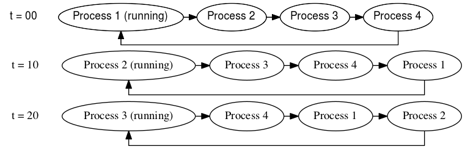

# Linux Scheduler Series

> This guide is adapted from a blog series written by Mitchell Gouzenko, a
> former OS TA. The original posts can be found
> [here](https://mgouzenko.github.io/jekyll/update/2016/11/04/the-linux-process-scheduler.html).
>
> The code snippets and links in this post correspond to Linux v5.10.158.

## Introduction

I'm writing this series after TA-ing an operating systems class for two
semesters. Each year, tears begin to flow by the time we get to the infamous
Scheduler Assignment - where students are asked to implement a round-robin
scheduler in the Linux kernel. The assignment is known to leave relatively
competent programmers in shambles. I don't blame them; the seemingly simple task
of writing a round robin scheduler is complicated by two confounding factors:

* The Linux scheduler is cryptic as hell and on top of that, very poorly
  documented.
* Bugs in scheduler code will often trigger a kernel panic, freezing the system
  without providing any logs or meaningful error messages.

I hope to ease students' suffering by addressing the first bullet point. In this
series, I will explain how the scheduler's infrastructure is set up, emphasizing
how one may leverage its modularity to plug in their own scheduler.

We'll begin by examining the basic role of the core scheduler and how the rest
of the kernel interfaces with it. Then, we'll look at `sched_class`, the modular
data structure that permits various scheduling algorithms to live and operate
side-by-side in the kernel.

### A Top Down Approach

Initially, I'll treat the scheduler as a black box. I will make gross
over-simplifications but note very clearly when I do so. Little by little, we
will delve into the scheduler's internals, unfolding the truth behind these
simplifications. By the end of this series, you should be able to start tackling
the problem of writing your own working scheduler.

### Disclaimer

I'm not an expert kernel hacker. I'm just a student who has spent a modest
number of hours reading, screaming at, and sobbing over kernel code. If I make a
mistake, please point it out in the comments section, and I'll do my best to
correct it.

## What is the Linux Scheduler?

Linux is a multi-tasking system. At any instant, there are many processes active
at once, but a single CPU can only perform work on behalf of one process at a
time. At a high level, Linux context switches from process to process, letting
the CPU perform work on behalf of each one in turn. This switching occurs
quickly enough to create the illusion that all processes are running
simultaneously. **The scheduler is in charge of coordinating all of this
switching.**

### Where Does the Scheduler Fit?

You can find most scheduler-related code under `kernel/sched`. Now, the
scheduler has a distinct and non-trivial job. The rest of the kernel doesn't
know or care how the scheduler performs its magic, as long as it can be called
upon to schedule tasks. So, to hide the complexity of the scheduler, it is
invoked with a simple and well-defined API. The scheduler - from the perspective
of the rest of the kernel - has two main responsibilities:

* **Responsibility I**: Provide an interface to halt the currently running
process and switch to a new one. To do so, the scheduler must pick the next
process to run, which is a nontrivial problem.

* **Responsibility II**: Indicate to the rest of the OS when a new process
should be run.

### Responsibility I: Switching to the Next Process

To fulfill its first responsibility, the scheduler must somehow keep track of
all the running processes.

### The Runqueue

Here's the first over-simplification: you can think of the scheduler as a system
that maintains a simple queue of processes in the form of a linked list. The
process at the head of the queue is allowed to run for some "time slice" - say,
10 milliseconds. After this time slice expires, the process is moved to the back
of the queue, and the next process gets to run on the CPU for the same time
slice. When a running process is forcibly stopped and taken off the CPU in this
way, we say that it has been **preempted**. The linked list of processes waiting
to have a go on the CPU is called the runqueue. Each CPU has its own runqueue,
and a given process may appear on only one CPU's runqueue at a time. Processes
CAN migrate between various CPUs' runqueues, but we'll save this discussion for
later.

<div align='center'>
    <br/>
    Figure 1: An over-simplification of the runqueue
</div>

The scheduler is not really this simple; the runqueue is defined in the kernel
as `struct rq`, and you can take a peek at its definition
[here](https://elixir.bootlin.com/linux/v5.10.158/source/kernel/sched/sched.h#L897).
Spoiler alert: it's not a linked list! To be fair, the explanation that I gave
above more or less describes the very first Linux runqueue. But over the years,
the scheduler evolved to incorporate multiple scheduling algorithms. These
include:

  * Completely Fair Scheduler (CFS)
  * Real-Time Scheduler
  * Deadline Scheduler

The modern-day runqueue is no longer a linked list but actually a collection of
algorithm-specific runqueues corresponding to the list above. Indeed,
`struct rq` has the following members:

```c
struct cfs_rq cfs;  // CFS scheduler runqueue
struct rt_rq rt;    // Real-time scheduler runqueue
struct dl_rq dl;    // Deadline scheduler runqueue
```

For example, CFS, which is the default scheduler in modern Linux kernels, uses a
red-black tree data structure to keep track of processes, with each process
assigned a "virtual runtime" that determines its priority in the scheduling
queue. The scheduler then selects the process with the lowest virtual runtime to
run next, ensuring that each process gets a fair share of CPU time over the long
term.

Keep these details in the back of your mind so that you don't get bogged down.
Remember: the goal here is to understand how the scheduler interoperates with
the rest of the kernel. The main takeaway is that a process is allowed to run
for some time, and when that time expires, it gets preempted so that the next
process can run.

### Preemption vs Yielding

Preemption is not always the reason a process is taken off the CPU. For example,
a process might voluntarily go to sleep, waiting for an IO event or lock. To do
this, the process puts itself on a "wait queue" and takes itself off the
runqueue. In this case, the process has **yielded** the CPU. In summary:

* "preemption" is when a process is forcibly kicked off the CPU.

* "yielding" is when a process voluntarily gives up the CPU.

In addition to an expired timeslice, there are several other reasons that
preemption may occur. For example, when an interrupt occurs, the CPU may be
preempted to handle the interrupt. Additionally, a real-time process may have a
higher priority than some other process and may preempt lower-priority processes
to ensure that it meets its deadline.

### `schedule()`

With a conceptual understanding of the runqueue, we now have the background to
understand how Responsibility I is carried out by the scheduler. The
`schedule()` function is the crux of Responsibility I: it halts the currently
running process and runs the next one on the CPU. This function is referred to
by many texts as "the entrypoint into the scheduler". `schedule()` invokes
`__schedule()` to do most of the real work. Here is the portion relevant to us:

```c
static void __sched notrace __schedule(bool preempt)
{
	struct task_struct *prev, *next;
	unsigned long *switch_count;
	struct rq *rq;

	/* CODE OMITTED */

	next = pick_next_task(rq, prev, &rf);
	clear_tsk_need_resched(prev);
	clear_preempt_need_resched();

	if (likely(prev != next)) {
		rq->nr_switches++;
		RCU_INIT_POINTER(rq->curr, next);
		++*switch_count;

		psi_sched_switch(prev, next, !task_on_rq_queued(prev));
		trace_sched_switch(preempt, prev, next);
		rq = context_switch(rq, prev, next, &rf);
	}

	/* CODE OMITTED */
}
```

`pick_next_task()` looks at the runqueue `rq` and returns the `task_struct`
associated with the process that should be run next. If we consider t=10 in
Figure 1, `pick_next_task()` would return the `task_struct` for Process 2. Then,
`context_switch()` switches the CPU's state to that of the returned
`task_struct`. This fullfills Responsibility I.

## Responsibility II: When Should the Next Process Run?

Great, so we've seen that `schedule()` is used to context switch to the next
task. But when does this *actually* happen?

As mentioned previously, a user-space program might voluntarily go to sleep
waiting for an IO event or a lock. In this case, the kernel will call
`schedule()` on behalf of the process that needs to sleep. But what if the
user-space program never sleeps? Here's one such program:

```c
int main()
{
	while(1);
}
```

If `schedule()` were only called when a user-space program voluntarily sleeps,
then programs like the one above would use up the processor indefinitely. Thus,
we need a mechanism to preempt processes that have exhausted their time slice!

This preemption is accomplished via the timer interrupt. The timer interrupt
fires periodically, allowing control to jump to the timer interrupt handler in
the kernel. This handler calls the function `update_process_times()`, shown
below.

```c
/*
 * Called from the timer interrupt handler to charge one tick to the current
 * process.  user_tick is 1 if the tick is user time, 0 for system.
 */
void update_process_times(int user_tick)
{
	struct task_struct *p = current;

	PRANDOM_ADD_NOISE(jiffies, user_tick, p, 0);

	/* Note: this timer irq context must be accounted for as well. */
	account_process_tick(p, user_tick);
	run_local_timers();
	rcu_sched_clock_irq(user_tick);
#ifdef CONFIG_IRQ_WORK
	if (in_irq())
		irq_work_tick();
#endif
	scheduler_tick();
	if (IS_ENABLED(CONFIG_POSIX_TIMERS))
		run_posix_cpu_timers();
}
```

Notice how `update_process_times()` invokes `scheduler_tick()`. In
`scheduler_tick()`, the scheduler checks to see if the running process's time
has expired. If so, it sets a (over-simplification alert) per-CPU flag called
`need_resched`. This indicates to the rest of the kernel that `schedule()`
should be called. In our simplified example, `scheduler_tick()` would set this
flag when the current process has been running for 10 milliseconds or more.

But wait, why the heck can't `scheduler_tick()` just call `schedule()` by
itself, from within the timer interrupt? After all, if the scheduler knows that
a process's time has expired, shouldn't it just context switch right away?

As it turns out, it is not always safe to call `schedule()`. In particular, if
the currently running process is holding a spinlock in the kernel, it cannot be
put to sleep from the interrupt handler. (Let me repeat that one more time
because people always forget: **you cannot sleep with a spinlock.** Sleeping
with a spinlock may cause the kernel to deadlock, and will bring you anguish
for many hours when you can't figure out why your system has hung.)

When the scheduler sets the `need_resched` flag, it's really saying, "please
dearest kernel, invoke `schedule()` at your earliest convenience." The kernel
keeps a count of how many spinlocks the currently running process has acquired.
When that count goes down to 0, the kernel knows that it's okay to put the
process to sleep. The kernel checks the `need_resched` flag in two main places:

* when returning from an interrupt handler

* when returning to user-space from a system call

If `need_resched` is `True` and the spinlock count is 0, then the kernel calls
`schedule()`. With our simple linked-list runqueue, this delayed invocation of
`schedule()` implies that a process can possibly run for a bit longer than its
timeslice. We're cool with that because it's always safe to call `schedule()`
when the kernel is about to return to user-space. That's because user-space
programs are allowed to sleep. So, by the time the kernel is about to return to
user-space, it cannot be holding any spinlocks. This means that there won't be a
large delay between when `need_resched` is set, and when `schedule()` gets
called.

## Understanding `sched_class`

In this section, I will analyze `struct sched_class` and talk briefly about what
most of the functions do. I've reproduced `struct sched_class` below.

```c
struct sched_class {

#ifdef CONFIG_UCLAMP_TASK
	int uclamp_enabled;
#endif

	void (*enqueue_task) (struct rq *rq, struct task_struct *p, int flags);
	void (*dequeue_task) (struct rq *rq, struct task_struct *p, int flags);
	void (*yield_task)   (struct rq *rq);
	bool (*yield_to_task)(struct rq *rq, struct task_struct *p);

	void (*check_preempt_curr)(struct rq *rq, struct task_struct *p, int flags);

	struct task_struct *(*pick_next_task)(struct rq *rq);

	void (*put_prev_task)(struct rq *rq, struct task_struct *p);
	void (*set_next_task)(struct rq *rq, struct task_struct *p, bool first);

#ifdef CONFIG_SMP
	int (*balance)(struct rq *rq, struct task_struct *prev, struct rq_flags *rf);
	int  (*select_task_rq)(struct task_struct *p, int task_cpu, int sd_flag, int flags);
	void (*migrate_task_rq)(struct task_struct *p, int new_cpu);

	void (*task_woken)(struct rq *this_rq, struct task_struct *task);

	void (*set_cpus_allowed)(struct task_struct *p,
				 const struct cpumask *newmask);

	void (*rq_online)(struct rq *rq);
	void (*rq_offline)(struct rq *rq);
#endif

	void (*task_tick)(struct rq *rq, struct task_struct *p, int queued);
	void (*task_fork)(struct task_struct *p);
	void (*task_dead)(struct task_struct *p);

	/*
	 * The switched_from() call is allowed to drop rq->lock, therefore we
	 * cannot assume the switched_from/switched_to pair is serliazed by
	 * rq->lock. They are however serialized by p->pi_lock.
	 */
	void (*switched_from)(struct rq *this_rq, struct task_struct *task);
	void (*switched_to)  (struct rq *this_rq, struct task_struct *task);
	void (*prio_changed) (struct rq *this_rq, struct task_struct *task,
			      int oldprio);

	unsigned int (*get_rr_interval)(struct rq *rq,
					struct task_struct *task);

	void (*update_curr)(struct rq *rq);

#define TASK_SET_GROUP		0
#define TASK_MOVE_GROUP		1

#ifdef CONFIG_FAIR_GROUP_SCHED
	void (*task_change_group)(struct task_struct *p, int type);
#endif
} __aligned(STRUCT_ALIGNMENT); /* STRUCT_ALIGN(), vmlinux.lds.h */
```

### `enqueue_task()` and `dequeue_task()`

```c
/* Called to enqueue task_struct p on runqueue rq. */
void enqueue_task(struct rq *rq, struct task_struct *p, int flags);

/* Called to dequeue task_struct p from runqueue rq. */
void dequeue_task(struct rq *rq, struct task_struct *p, int flags);
```

`enqueue_task()` and `dequeue_task()` are used to put a task on the runqueue and
remove a task from the runqueue, respectively.

These functions are called for a variety of reasons:

* When a child process is first forked, `enqueue_task()` is called to put it on
  a runqueue. When a process exits, `dequeue_task()` takes it off the runqueue.

* When a process goes to sleep, `dequeue_task()` takes it off the runqueue. For
  example, this happens when the process needs to wait for a lock or IO event.
  When the IO event occurs, or the lock becomes available, the process wakes up.
  It must then be re-enqueued with `enqueue_task()`.

* Process migration - if a process must be migrated from one CPU's runqueue to
  another, it's dequeued from its old runqueue and enqueued on a different one
  using this function.

* When `set_cpus_allowed()` is called to change the task's processor affinity,
  it may need to be enqueued on a different CPU's runqueue.

* When the priority of a process is boosted to avoid priority inversion. In this
  case, the task used to have a low-priority `sched_class`, but is being
  promoted to a `sched_class` with high priority. This action occurs in
  `rt_mutex_setprio()`.

* From `__sched_setscheduler`. If a task's `sched_class` has changed, it's
  dequeued using its old `sched_class` and enqueued with the new one.

Each of these functions are passed the task to be enqueued/dequeued, as well as
the runqueue it should be added to/removed from. In addition, these functions
are given a bit vector of flags that describe *why* enqueue or dequeue is being
called. Here are the various flags, which are described in
[sched.h](https://elixir.bootlin.com/linux/v5.10.158/source/kernel/sched/sched.h#L1743):

```c
/*
 * {de,en}queue flags:
 *
 * DEQUEUE_SLEEP  - task is no longer runnable
 * ENQUEUE_WAKEUP - task just became runnable
 *
 * SAVE/RESTORE - an otherwise spurious dequeue/enqueue, done to ensure tasks
 *                are in a known state which allows modification. Such pairs
 *                should preserve as much state as possible.
 *
 * MOVE - paired with SAVE/RESTORE, explicitly does not preserve the location
 *        in the runqueue.
 *
 * ENQUEUE_HEAD      - place at front of runqueue (tail if not specified)
 * ENQUEUE_REPLENISH - CBS (replenish runtime and postpone deadline)
 * ENQUEUE_MIGRATED  - the task was migrated during wakeup
 *
 */
```

The `flags` argument can be tested using the bitwise `&` operation. For example,
if the task was just migrated from another CPU, `flags & ENQUEUE_MIGRATED`
evaluates to 1.

### `pick_next_task()`

```c
/* Pick the task that should be currently running. */
struct task_struct *pick_next_task(struct rq *rq);
```

`pick_next_task()` is called by the core scheduler to determine which of `rq`'s
tasks should be running. The name is a bit misleading: This function is not
supposed to return the task that should run *after* the currently running task;
instead, it's supposed to return the `task_struct` that should be running now,
**in this instant.**

The kernel will context switch from the currently running task to the task
returned by `pick_next_task()`.

### `put_prev_task()`

```c
/* Called right before p is going to be taken off the CPU. */
void put_prev_task(struct rq *rq, struct task_struct *p);
```

`put_prev_task()` is called whenever a task is to be taken off the CPU. The
behavior of this function is up to the specific `sched_class`. Some schedulers
do very little in this function. For example, the realtime scheduler uses this
function as an opportunity to perform simple bookkeeping. On the other hand,
CFS's `put_prev_task_fair()` needs to do a bit more work. As an optimization,
CFS keeps the currently running task out of its RB tree. It uses the
`put_prev_task` hook as an opportunity to put the currently running task (that
is, the task specified by `p`) back in the RB tree.

The sched_class's `put_prev_task` is called by the function `put_prev_task()`,
which is
[defined](https://elixir.bootlin.com/linux/v5.10.158/source/kernel/sched/sched.h#L1841)
in `sched.h`. `put_prev_task()` gets called in the core scheduler's
`pick_next_task()`, after the policy-specific `pick_next_task()` implementation
is called, but before any context switch is performed. This gives us an
opportunity to perform any operations we need to do to move on from the
previously running task in our scheduler implementations.

Note that this was not the case in older kernels: The `sched_class`'s
`pick_next_task()` is expected to call `put_prev_task()` by itself! This is
documented in the following
[comment](https://elixir.bootlin.com/linux/v4.9.330/source/kernel/sched/sched.h#L1241)
in an earlier Linux version (4.9). Before that (3.11), `put_prev_task` actually
[used to be called](https://elixir.bootlin.com/linux/v3.11/source/kernel/sched/core.c#L2445)
by the core scheduler before it called `pick_next_task`.

### `task_tick()`

```c
/* Called from the timer interrupt handler. p is the currently running task
 * and rq is the runqueue that it's on.
 */
void task_tick(struct rq *rq, struct task_struct *p, int queued);
```

This is one of the most important scheduler functions. It is called whenever a
timer interrupt happens, and its job is to perform bookeeping and set the
`need_resched` flag if the currently-running process needs to be preempted:

The `need_resched` flag can be set by the function `resched_curr()`,
[found](https://elixir.bootlin.com/linux/v5.10.158/source/kernel/sched/core.c#L608)
in core.c:

```c
/* Mark rq's currently-running task 'to be rescheduled now'. */
void resched_curr(struct rq *rq)
```

With SMP, there's a `need_resched` flag for every CPU. Thus, `resched_curr()`
might involve sending an APIC inter-processor interrupt to another processor
(you don't want to go here). The takeway is that you should just use
`resched_curr()` to set `need_resched`, and don't try to do this yourself.

Note: in prior kernel versions, `resched_curr()` used to be called
`resched_task()`.

### `select_task_rq()`

```c
/* Returns an integer corresponding to the CPU that this task should run on */
int select_task_rq(struct task_struct *p, int task_cpu, int sd_flag, int flags);
```

The core scheduler invokes this function to figure out which CPU to assign a
task to. This is used for distributing processes accross multiple CPUs; the core
scheduler will call `enqueue_task()`, passing the runqueue corresponding to the
CPU that is returned by this function. CPU assignment obviously occurs when a
process is first forked, but CPU reassignment can happen for a large variety of
reasons. Here are some instances where `select_task_rq()` is called:

* When a process is first forked.

* When a task is woken up after having gone to sleep.

* In response to any of the syscalls in the execv family. This is an
  optimization, since it doesn't hurt the cache to migrate a process that's
  about to call exec.

* And many more places...

You can check *why* `select_task_rq` was called by looking at `sd_flag`.

For instance, `sd_flag == SD_BALANCE_FORK` whenever `select_task_rq()` is called
to determine the CPU of a newly forked task. You can find all possible values of
`sd_flag`
[here](https://elixir.bootlin.com/linux/v5.10.158/source/include/linux/sched/sd_flags.h).

Note that `select_task_rq()` should return a CPU that `p` is allowed to run on.
Each `task_struct` has a
[member](https://elixir.bootlin.com/linux/v5.10.158/source/include/linux/sched.h#L728)
called `cpus_mask`, of type `cpumask_t`. This member represents the task's CPU
affinity - i.e. which CPUs it can run on. It's possible to iterate over these
CPUs with the macro `for_each_cpu()`, defined
[here](https://elixir.bootlin.com/linux/v5.10.158/source/include/linux/cpumask.h#L263).

### `set_next_task()`

```c
/* Called when a task changes its scheduling class or changes its task group. */
void set_next_task(struct rq *rq, struct task_struct *p, bool first);
```

This function is called in the following instances:

* When the current task's CPU affinity changes.

* When the current task's priority, nice value, or scheduling policy changes.

* When the current task's task group changes.

This function was previously called `set_curr_task()`, but was changed to better
match `put_prev_task()`. Several scheduling policies also call `set_next_task()`
in their implementations of `pick_next_task()`. An [old kernel
commit](https://lore.kernel.org/all/a96d1bcdd716db4a4c5da2fece647a1456c0ed78.1559129225.git.vpillai@digitalocean.com/T/#m2632708495575d24c1a5c54f7295836a907d3d53)
claims that `pick_next_task()` implies `set_next_task()`, but `pick_next_task()`
technically shouldn't modify any state. In practice, this means that
`set_next_task()` ends up just updating some of the task's metadata.

### `yield_task()`

```c
/* Called when the current task yields the cpu */
void yield_task(struct rq *rq);
```

`yield_task()` is used when the current process voluntarily yields its remaining
time on the CPU. Its implementation is usually very simple, as you can see in
[rt](https://elixir.bootlin.com/linux/v5.10.158/source/kernel/sched/rt.c#L1434),
which simply requeues the current task.

This function is called when a process calls the `sched_yield()` syscall to
relinquish the control of the processor voluntarily. `schedule()` is then
called.

### `check_preempt_curr()`

```c
/* Preempt the current task with a newly woken task if needed */
void check_preempt_curr(struct rq *rq, struct task_struct *p, int flags)
```

When a new task enters a runnable state, this function is called to check if
that task should preempt the currently running task. For instance, when a new
task is created, it is initially woken up with `wake_up_new_task()`, which
(among other things) places the task on the runqueue, calls the generic
`check_preempt_curr()`, and calls the `sched_class->task_woken()` function if it
exists.

The generic `check_preempt_curr()` function does the following:

```c
void check_preempt_curr(struct rq *rq, struct task_struct *p, int flags)
{
	if (p->sched_class == rq->curr->sched_class)
		rq->curr->sched_class->check_preempt_curr(rq, p, flags);
	else if (p->sched_class > rq->curr->sched_class)
		resched_curr(rq);

	/* CODE OMITTED */
}	
```

This handles both the case where the new task has a higher priority within a
scheduling class (using the callback pointer) or a higher priority scheduling
class.

### `balance()`

```c
int balance(struct rq *rq, struct task_struct *prev, struct rq_flags *rf);
```

`balance()` implements various scheduler load-balancing mechanisms, which are
meant to distribute the load across processors more evenly using various
heuristics. It returns `1` if there is a runnable task of that `sched_class`'s
priority or higher after load balancing occurs, and `0` otherwise.

`balance()` is called in `put_prev_task_balance()` (which is called in
`pick_next_task()`) as follows:

```c
static void put_prev_task_balance(struct rq *rq, struct task_struct *prev,
				  struct rq_flags *rf)
{
#ifdef CONFIG_SMP
	const struct sched_class *class;
	/*
	 * We must do the balancing pass before put_prev_task(), such
	 * that when we release the rq->lock the task is in the same
	 * state as before we took rq->lock.
	 *
	 * We can terminate the balance pass as soon as we know there is
	 * a runnable task of @class priority or higher.
	 */
	for_class_range(class, prev->sched_class, &idle_sched_class) {
		if (class->balance(rq, prev, rf))
			break;
	}
#endif

	put_prev_task(rq, prev);
}
```

The main idea is to prevent any runqueue from becoming empty, as this is a waste
of resources. This loop starts with the currently running task's `sched_class`
and uses the `balance()` callbacks to check if there are runnable tasks of that
`sched_class`'s priority _or higher_. Notably, `sched_class`'s implementation of
`balance()` check if `sched_class`s of higher priority also have runnable tasks.

### `update_curr()`

```c
/* Update the current task's runtime statistics. */
void update_curr(struct rq *rq);
```

This function updates the current task's stats such as the total execution time.
Implementing this function allows commands like `ps` and `htop` to display
accurate statistics. The implementations of this function typically share a
common segment across the different scheduling classes. This function is
typically called in other `sched_class` functions to facilitate accurate
reporting of statistics.

### `prio_changed()`

```c
/* Called when the task's priority has changed. */
void prio_changed(struct rq *rq, struct task_struct *p, int oldprio)
```

This function is called whenever a task's priority changes, but the
`sched_class` remains the same (you can verify this by checking where the
function pointer is called). This can occur through various syscalls which
modify the `nice` value, the priority, or other scheduler attributes.

In a scheduler class with priorities, this function will typically check if the
task whose priority changed needs to preempt the currently running task (or if
it is the currently running task, if it should be preempted).

### `switched_to()`

```c
/* Called when a task gets switched to this scheduling class. */
void switched_to(struct rq *rq, struct task_struct *p);
```

`switched_to()` (and its optional counterpart, `switched_from()`) are called
from `check_class_changed()`:

```c
static inline void check_class_changed(struct rq *rq, struct task_struct *p,
				       const struct sched_class *prev_class,
				       int oldprio)
{
	if (prev_class != p->sched_class) {
		if (prev_class->switched_from)
			prev_class->switched_from(rq, p);

		p->sched_class->switched_to(rq, p);
	} else if (oldprio != p->prio || dl_task(p))
		p->sched_class->prio_changed(rq, p, oldprio);
}
```

`check_class_changed()` gets called from syscalls that modify scheduler
parameters.

For scheduler classes like
[rt](https://elixir.bootlin.com/linux/v5.10.158/source/kernel/sched/rt.c#L2303)
and
[dl](https://elixir.bootlin.com/linux/v5.10.158/source/kernel/sched/deadline.c#L2456),
the main consideration when a task's policy changes to their policy is that it
could overload their runqieue. They then try to push some tasks to other
runqueues.

However, for lower priority scheduler classes, like CFS, where overloading is
not an issue, `switched_to()` just ensures that the task gets to run, and
preempts the current task (which may be of a lower-priority policy) if
necessary.
